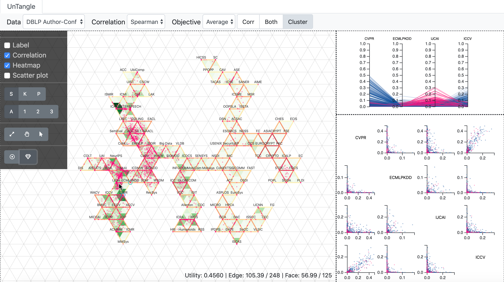

# NYU VisML2020 Project - Interactive UnTangle Map

This project rebuilds and enhances the UnTangle Map system proposed by [this paper](http://citeseerx.ist.psu.edu/viewdoc/download?doi=10.1.1.723.165&rep=rep1&type=pdf)

## Set up

```bash
# go to ./src and set up server
cd ./src
python -m http.server
```

## Files

```./src``` - layout algorithm and interface source code

```./data``` - data processing

- ```IMDB``` - movie dataset from https://www.kaggle.com/orgesleka/imdbmovies
- ```DBLP``` - DBLP dataset from https://dblp.org/xml/, and h-index data from http://www.guide2research.com/

```./ext``` - other references

- ```DBLPParser``` - modified from https://github.com/IsaacChanghau/DBLPParser
-  ```d3samples``` - d3 references

```./doc``` - figures in document

## Results

